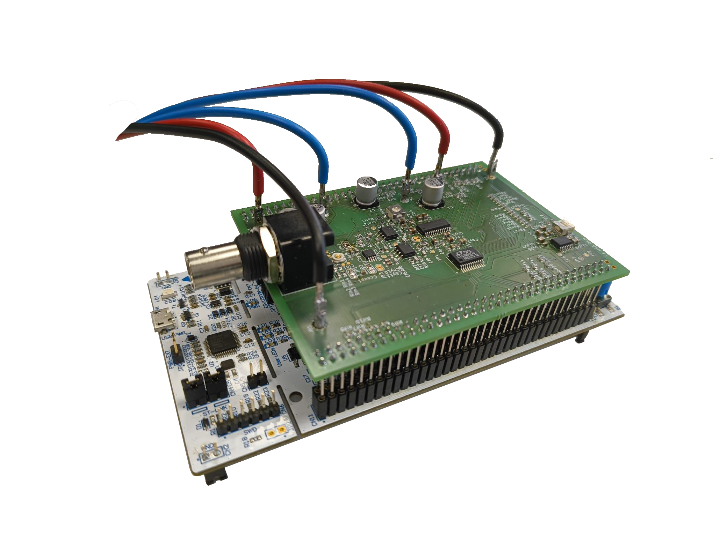

# Introduction
This repository serves as documentation and overview of the project **USB-oscilloscope**,
which was carried out in the summer semester 2025 at the efi faculty of the University of Applied Sciences Nuremberg (Georg-Simon-Ohm).
# Overview
### Project structure:

<ins>legend:</ins>\
HW - hardware\
FW - firmware\
SW - software

### USB oscilloscope prototype:

### Documentation:
PDF [GER]: [Dokumentation_Projekt_USB_Oszi.pdf](docs/documentation/LATEX_german/Dokumentation_Projekt_USB_Oszi.pdf)
